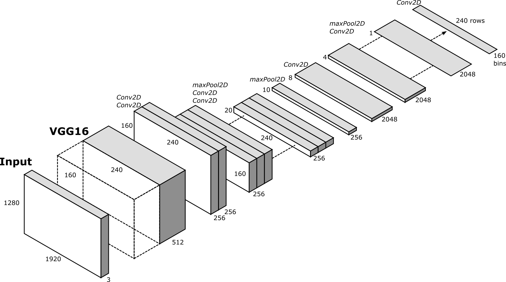
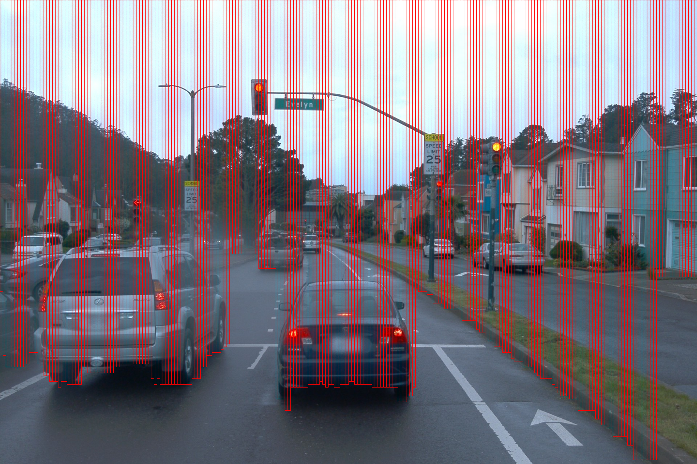

[](https://opensource.org/licenses/MIT)

# Obstacle Detection With StixelNet #
The repository is a fork of the original project by xmba15 and provides an adapted workaround for a training with data
from the Waymo Open Dataset. A training/val and testing set can be provided on demand.

## Dependencies ##
- tested on the following environment:
  + OS: tested on Ubuntu 20.04
  + Tensorflow 2.6.0
  + python 3.8
- installing the dependencies:
  + python3 -m pip install -r requirements.txt

## Training Data  ##
### Waymo Raw Dataset ###

### Ground Truth
- Sample of automatically generated ground truth from LiDAR pointclouds
- [Scalability in Perception for Autonomous Driving: Waymo Open Dataset](https://arxiv.org/pdf/1912.04838)


## Adapted StixelNet Model ##


## Training ##
After downloading the dataset, run
```bash
    python3 ./train.py
```
model weights will be saved into ./saved_models directory

## Test one image ##
- Download pretrained model weights with
```bash
    t.b.d.
```

- Test on an image
```bash
  python3 ./test_single_image.py --model_path [path/to/model/weights]
```

## Sample Result ##


## References ##
- [StixelNet: A Deep Convolutional Network for Obstacle Detection and Road Segmentation](http://www.bmva.org/bmvc/2015/papers/paper109/paper109.pdf)
- [Real-time category-based and general obstacle detection for autonomous driving](http://openaccess.thecvf.com/content_ICCV_2017_workshops/papers/w3/Garnett_Real-Time_Category-Based_and_ICCV_2017_paper.pdf)
